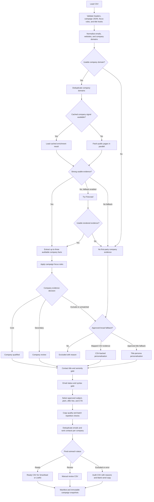

<div align="center">

# Bulk Enrich

### Prospect-specific outreach personalisation at CSV scale

Hand over a lead list, answer a few questions about the offer, and get back auditable, upload-ready outreach files. Each company's public website is read once, one model decision per company classifies fit and writes the opening line on your own Claude or ChatGPT subscription, and a deterministic engine checks every word before it reaches the ready file. No API keys, no per-row LLM calls.

[](https://github.com/DylanLamb888/bulk-enrich/actions/workflows/tests.yml)


[How it works](#how-it-works) · [Quick start](#quick-start) · [Campaign setup](#campaign-setup) · [Running a list](#running-a-list) · [Outputs](#outputs) · [Safety](#safety-and-boundaries)

</div>

---

## What this is

Bulk Enrich is a reusable Claude Code and Codex Skill backed by a Python CLI. Think of it as a self-hosted Clay personalisation column with rules: it is designed for large outreach lists where calling an LLM once per prospect would be slow, hard to audit, and easy to get wrong.

The Skill runs the setup as a conversation: it asks about the offer, proof, risk reversal, and call to action, reads a sample of the companies, proposes the target market in plain English, and writes the campaign file. The bulk runner then processes every row:

- fetch each unique public company domain once and cache it;
- ask the model once per company, several companies per call, whether it fits the target, which sentence proves it, and what a personalised opening should say;
- verify the quoted evidence is really on the page and run the opening through the copy gates;
- qualify the company, contact, and supplied email;
- assemble the email from the opening plus approved offer-line, CTA, and subject variants;
- run batch-level quality and repetition checks;
- write separate audit, ready, and review files.

> [!IMPORTANT]
> The model classifies each company and writes its opening line only; the commercial claims, offer line, CTA, and subject always come from approved variants. The CLI never discovers emails, verifies addresses with external providers, uploads leads, or sends campaigns.

## At a glance

| Capability | Behaviour |
| --- | --- |
| Bulk method | One pass across the CSV, one cached model decision per unique company |
| Model access | Your Claude Code or Codex CLI login by default; Anthropic API optional |
| Website access | Parallel requests to public company pages |
| Difficult websites | Optional Firecrawl fallback |
| Duplicate domains | Fetched once and reused |
| Cache | Persistent HTTP, Firecrawl, and extracted-signal caches |
| Campaign logic | Offer and niche rules live in JSON and CSV configuration |
| Personalisation | A model-written opening specific to each company, verified against its website; approved templates as fallback |
| Company classification | Plain-English target and exclusions judged by the model; regex focus rules as fallback |
| Usage guards | Premium models refused unless opted in; per-run nominal budget; usage estimate before every run |
| Quality control | Word limits, banned phrases, source-overlap checks, and batch repetition gates |
| Final statuses | `ready`, `review`, `excluded`, or `error` |
| Delivery | Smartlead/ListKit-compatible CSVs plus a complete audit trail |
| Sending | Never automatic |

## How it works



### Decision order

1. Website evidence takes priority over supplied CSV enrichment.
2. Campaign focus rules classify the evidence as `core`, `secondary`, or `exclude`.
3. Broad title fallback is used only when the campaign explicitly enables it.
4. Contact title and seniority rules are applied independently from company fit.
5. Supplied email status and conservative syntax validation determine email usability.
6. Copy must pass both row-level and batch-level quality checks.
7. Only the strongest eligible contact at each company remains ready for the first wave.

## Core design principles

### Deterministic where it counts

Model decisions are made once per company and cached, so the same input, campaign, and cache produce the same CSV output on every re-run. Template, offer-line, and CTA selection use stable company identities rather than randomness, and every gate that decides whether a row is ready is plain code.

### Offer-agnostic

No M&A, CFO, recruitment, logistics, or client-specific terminology is hard-coded into the Python engine. Each campaign carries its own offer, target-company evidence, contact rules, copy, claims, and exclusions.

### Auditable

Every row records the selected evidence, its source, the matching rule, the template used, qualification decisions, copy warnings, and the final outreach reason.

### Conservative by default

Strict campaigns fail closed when evidence is weak or off-target. A model answer without a verbatim quote from the page is rejected, and a pitch that breaks a copy rule is dropped in favour of an approved template. A broader title-persona route is available, but it must be deliberately enabled in the campaign.

## Requirements

- Python 3.11 or newer
- A CSV containing lead and company data
- Public company domains for website-based personalisation
- Optional Firecrawl access for JavaScript-heavy or difficult websites
- No Python runtime dependencies beyond the standard library
- A signed-in Claude Code or Codex CLI when a campaign enables model classification; the `llm` extra plus an Anthropic API key is only needed for the optional `api` provider

## Quick start

### 1. Clone the repository

```bash
git clone https://github.com/DylanLamb888/bulk-enrich.git
cd bulk-enrich
```

### 2. Confirm the CLI

```bash
python scripts/enrich.py --version
python scripts/enrich.py --help
```

The repository entrypoint works directly. An optional local command can also be installed with:

```bash
uv tool install .
bulk-enrich --help
```

### 3. Install the shared Claude Code and Codex Skill

Preview the links first:

```bash
python scripts/install_skill.py --target both --dry-run
```

Install them:

```bash
python scripts/install_skill.py --target both
```

This creates one symlink under each product:

```text
~/.codex/skills/bulk-outreach-personalizer
~/.claude/skills/bulk-outreach-personalizer
```

Both products use the same tracked Skill source, so their instructions cannot drift into separate copies. The installer is idempotent and refuses to overwrite a different existing Skill.

### 4. Invoke the Skill

Example prompt:

```text
Use $bulk-outreach-personalizer to personalise leads.csv for my offer.
```

The Skill interviews you about the offer, proof, risk reversal, and call to action, reads a sample of the companies, proposes the target market and exclusions, writes the campaign file, runs a sample, and reads finished emails back before asking for approval. The full-list run still makes one cached model decision per company, never one per row.

## Input CSV

Header aliases are matched case-insensitively and tolerate spaces or underscores.

| Information | Common headers | Requirement |
| --- | --- | --- |
| Email | `Email`, `email_address`, `work_email` | Required |
| First name | `First name`, `first_name`, `firstname` | Required |
| Company name | `Company name`, `company_name`, `organization` | Required |
| Job title | `Job title`, `job_title`, `title` | Required for a contact to qualify |
| Company domain | `Company domain`, `company_domain`, `domain` | Recommended |
| Company website | `Company website`, `website`, `company url` | Recommended alternative to domain |
| Email status | `Email status`, `email_status`, `email verification status` | Optional according to campaign policy |
| Seniority | `Job seniority`, `seniority` | Optional, but enforced when present |
| Company intelligence | Description, keywords, products, industry, service tags | Optional campaign-approved fallback evidence |

A domain or website column is not mandatory for a deliberately broad title-fallback campaign. When no usable website exists, the engine uses a hashed company-name identity for deterministic copy variation, QA, and contact sequencing. It never presents that identity as website evidence.

For company qualification without contacts or copy, pass `--company-qualification-only`. In that mode the CSV needs only a company domain or website column; company name and LinkedIn URL columns are optional and preserved. Email, first name, job title, and email status are neither required nor evaluated.

## Campaign setup

Each client or offer receives two files:

```text
campaigns/local/client-campaign.json
campaigns/local/client-campaign-focus.csv
```

The `campaigns/local/` folder is ignored by Git because campaign copy and client claims may be sensitive.

### 1. Copy the templates

```bash
cp campaigns/campaign-template.json campaigns/local/client-campaign.json
cp campaigns/campaign-template-focus.csv campaigns/local/client-campaign-focus.csv
```

Update `personalization.focus_rules_file` inside the JSON so it points to the adjacent focus CSV.

### 2. Define the offer

The `offer` section contains:

| Field | Purpose |
| --- | --- |
| `service` | What the sender actually delivers |
| `audience` | The intended prospect or buyer |
| `risk_reversal` | Fallback commercial line |
| `risk_reversal_variants` | Approved offer angles distributed deterministically |
| `cta` | Fallback next step |
| `cta_variants` | Distinct, deliverable CTA variations |
| `approved_claims` | Claims the client has explicitly approved |
| `forbidden_claims` | Results, guarantees, or statements that must never appear |

Keep offer variants genuinely different in angle or structure. Changing one synonym does not create a meaningful test.

### 3. Define company-fit rules

The focus CSV contains exactly these columns:

| Column | Meaning |
| --- | --- |
| `id` | Unique lowercase rule identifier |
| `priority` | Evaluation order; lower numbers run first |
| `pattern` | Case-insensitive regular expression matched against evidence |
| `signal_types` | `product`, `service`, `audience`, `specialism`, `positioning`, or `*`; separate several with semicolons |
| `fit_tier` | `core`, `secondary`, or `exclude` |
| `focus` | Short commercial category safe to place in copy |
| `buyer_phrase` | Natural description of the people or companies the prospect may want to reach |

Example:

```csv
id,priority,pattern,signal_types,fit_tier,focus,buyer_phrase
commercial-cleaning,100,\bcommercial cleaning\b,service;specialism,core,commercial cleaning,facilities teams needing cleaning
facilities-services,200,\bfacilities management\b,service,secondary,facilities services,facilities teams
residential-cleaning,50,\bresidential cleaning\b,service,exclude,residential cleaning,homeowners needing cleaning
```

Use narrow patterns supported by real evidence. A company name alone never proves fit.

### 4. Define contact qualification

Campaign-specific regular expressions control:

- the priority order for selecting the strongest contact at a company;
- titles that can become `ready`;
- titles that require `review`;
- titles that must be `excluded`;
- accepted and review-only seniority levels.

When seniority is supplied, it must agree with the campaign policy. Later eligible contacts at the same company keep their copy but move to review for later waves.

### 5. Define the email policy

The campaign maps supplied verification labels into three groups:

- accepted, such as `verified` or `valid`;
- review, such as `catch-all`, `risky`, or `unknown`;
- rejected, such as `invalid` or `bounced`.

If the CSV has no verification status, `missing_status_action` can use conservative syntax validation, route the row to review, or exclude it.

### 6. Choose strict or broad fallback

`personalization.fallback_copy` is disabled by default.

| Mode | Behaviour |
| --- | --- |
| Strict | Requires campaign-mapped company evidence. Unmatched or excluded companies do not receive send copy. |
| Broad review | Uses approved title-persona copy but keeps fallback rows in review. |
| Broad ready | Allows approved title-persona copy to become ready after contact, email, and copy gates pass. |

Important controls:

| Setting | Effect |
| --- | --- |
| `allow_unmatched_company` | Allows title fallback when company evidence is unavailable or unmapped |
| `allow_single_csv_field` | Allows one approved CSV company field to support mapped copy |
| `promote_company_review` | Permits review-level company evidence to use the configured fallback status |
| `allow_explicit_company_exclusions` | Allows title fallback even after an exclusion rule; use only for genuinely broad campaigns |
| `status` | Sets fallback copy to `ready` or `review` before other gates are composed |
| `templates` | Approved subject and pitch templates grouped by title persona |

> [!WARNING]
> Keep `allow_explicit_company_exclusions` false when the campaign has genuine off-target company types. Enabling it is a deliberate coverage decision, not a default enrichment rule.

### 7. Define the copy

The final body is assembled from:

```text
greeting
personalised pitch
approved offer line
approved CTA
sender name
```

Supported merge fields include:

```text
{{first_name}}
{{company_name}}
{{company_short_name}}
{{job_title}}
{{company_focus}}
{{buyer_phrase}}
{{title_hook}}
{{persona}}
{{personalized_pitch}}
{{risk_reversal}}
{{cta}}
{{sender_name}}
```

The renderer preserves Smartlead spintax such as `{Hi|Hello}`.

### 8. Keep the campaign in test mode

New campaigns must remain:

```json
"status": "test_only"
```

Change the status to `approved` only after reviewing qualification decisions, fallback behaviour, and complete emails from a representative test.

## Running a list

### Company qualification only

Use this mode to decide which accounts belong in the target market before contact enrichment:

```bash
python scripts/enrich.py \
  --input /absolute/path/companies.csv \
  --output outputs/client-campaign/company-qualification-audit.csv \
  --ready-output outputs/client-campaign/company-fit.csv \
  --review-output outputs/client-campaign/company-needs-review.csv \
  --campaign campaigns/local/client-campaign.json \
  --company-qualification-only
```

The audit contains every company. `--ready-output` contains only `fit` companies and `--review-output` contains only `needs_review` companies. `not_fit` companies remain in the audit. This path never evaluates contacts or email addresses, sequences contacts, or renders outreach copy. A campaign marked `test_only` still requires `--allow-test-campaign` for a controlled run.

### Step 1. Validate without fetching websites

```bash
python scripts/enrich.py \
  --input /absolute/path/leads.csv \
  --output outputs/client-campaign/audit.csv \
  --campaign campaigns/local/client-campaign.json \
  --validate-only
```

Validation reports:

- row and header counts;
- detected columns;
- present and unique domains;
- duplicate-domain savings;
- duplicate emails;
- missing verification values;
- focus-rule tier counts;
- title-rule counts;
- campaign approval state;
- Firecrawl configuration state.

Validation does not fetch websites or write an output CSV.

### Step 2. Run a controlled sample

Start with 10–20 representative prospects plus adjacent negative examples.

```bash
python scripts/enrich.py \
  --input /absolute/path/sample.csv \
  --output outputs/client-campaign/sample-audit.csv \
  --ready-output outputs/client-campaign/sample-ready.csv \
  --review-output outputs/client-campaign/sample-review.csv \
  --campaign campaigns/local/client-campaign.json \
  --allow-test-campaign
```

Review:

- company evidence and source;
- focus rule and fit tier;
- contact and email decisions;
- selected pitch, offer line, and CTA;
- complete email wording;
- review and exclusion reasons;
- unmatched and excluded samples in the manifest;
- repetition warnings and script-test cohorts.

Refine the campaign configuration, not the Python engine, when the issue belongs to one niche or offer.

### Step 3. Approve the campaign

After manual approval, change the campaign status from `test_only` to `approved`.

### Step 4. Run the complete list

```bash
python scripts/enrich.py \
  --input /absolute/path/leads.csv \
  --output outputs/client-campaign/audit.csv \
  --ready-output outputs/client-campaign/smartlead-ready.csv \
  --review-output outputs/client-campaign/manual-review.csv \
  --campaign campaigns/local/client-campaign.json \
  --concurrency 24
```

Progress is reported per unique company domain. Duplicate domains reuse the same fetched evidence.

## Outputs

### CSV files

| File | Contents | Intended use |
| --- | --- | --- |
| Audit | Every original row plus evidence, copy, decisions, and reasons | Complete trace and diagnosis |
| Ready | Only rows with `outreach_status=ready` | Smartlead/ListKit upload |
| Review | Rows that need human judgement or belong to later contact waves | Manual approval |

Excluded rows remain in the audit file, but their send-copy fields are blank.

### Final statuses

| Status | Meaning |
| --- | --- |
| `ready` | Company, contact, email, copy, deduplication, and sequencing gates passed |
| `review` | No hard failure, but one or more rules require human review |
| `excluded` | At least one company, contact, email, or duplicate gate failed |
| `error` | Qualification passed but copy rendering failed |

### Audit fields

Important appended fields include:

- `personalized_subject`, `personalized_pitch`, and `personalized_email`;
- `personalization_source`, `personalization_evidence`, and `personalization_facts`;
- `personalization_focus_rule`, `personalization_template`, and `personalization_angle`;
- selected offer-line and CTA IDs plus their rendered text;
- company, contact, and email status, rule, and reason fields;
- company-contact rank and later-wave status;
- final `outreach_status` and `outreach_reason`.

See [docs/OUTPUTS.md](docs/OUTPUTS.md) for the complete field contract.

### Manifest and snapshots

Every run writes a JSON manifest beside the audit CSV. It contains:

- input and output SHA-256 hashes;
- campaign and focus-rule hashes;
- immutable campaign and focus snapshots;
- row, domain, cache, fetch, and status counts;
- company, contact, email, duplicate, and sequencing summaries;
- copy-quality warnings and flagged-row counts;
- offer script-test cohort distribution;
- unmatched and intentionally excluded focus samples;
- exact non-secret run settings.

## Smartlead and ListKit workflow

1. Run the campaign with `--ready-output` and `--review-output`.
2. Inspect the ready file headers and several complete emails.
3. Confirm `outreach_status` is `ready` for every upload row.
4. Upload the ready CSV to Smartlead or ListKit.
5. Map `personalized_subject` and `personalized_email`, or the individual copy fields required by the sequence.
6. Keep review rows outside the first campaign until manually approved.
7. Use later-wave contacts only after the primary company contact has completed the intended sequence.

The tool never uploads or sends automatically.

## Caching and performance

The default cache lives under `var/cache/` and uses a seven-day lifetime.

| Cache | Purpose |
| --- | --- |
| HTTP success/failure | Prevent repeated direct requests |
| Firecrawl success/failure | Prevent repeated rendered-page requests |
| Site signals | Reuse extracted company facts across campaigns and reruns |

Useful options:

```bash
# Ignore existing entries and fetch fresh pages
python scripts/enrich.py ... --refresh-cache

# Remove entries older than the configured TTL before running
python scripts/enrich.py ... --prune-cache

# Use a different persistent cache directory
python scripts/enrich.py ... --cache-dir /absolute/path/cache
```

Runtime depends mainly on the number of unique uncached domains and network response times, not the number of CSV rows. Cached reruns normally make no website requests.

## Optional Firecrawl fallback

Direct HTTP remains the first pass. Firecrawl is attempted only when direct fetching fails or produces weak content.

Copy the safe environment template:

```bash
cp .env.example .env
```

Self-hosted configuration:

```bash
FIRECRAWL_API_URL=http://localhost:3002
```

Hosted configuration:

```bash
FIRECRAWL_API_KEY=your-key-in-the-shell-environment
```

Run with fallback enabled:

```bash
python scripts/enrich.py \
  --input /absolute/path/leads.csv \
  --output outputs/client-campaign/audit.csv \
  --campaign campaigns/local/client-campaign.json \
  --firecrawl-fallback
```

Never place API keys in campaign JSON, CSV files, command arguments, tracked files, or chat. Shell variables take precedence over `.env` values.

## Setting up a campaign by conversation

The Skill drives setup as an interview: hand Claude Code or Codex the CSV, answer questions about the offer, proof, risk reversal, and call to action, and let it read a sample of the companies before it proposes the target market. `--digest-only` supports that step by fetching each company's pages and writing their text into `company_page_digest` with no campaign and no model:

```bash
python scripts/enrich.py --input /absolute/path/leads.csv --output outputs/client/digests.csv --digest-only
```

The script for the conversation is in `skill/bulk-outreach-personalizer/references/interview.md`.

## Optional model classification

Regex focus rules cannot read intent. On broad lists most readable websites match no rule and fall to title fallback, and a rebranded domain or a stale CSV segment can produce a confident but wrong pitch. `personalization.llm_focus` replaces only that one decision with a model call, made once per unique company domain and never per row.

No API key is required. The default provider is the locally installed Claude Code CLI in headless mode, which runs on your own Claude subscription login. Each call packs several domains into one prompt, disables every tool, MCP server, hook, and project file, and runs in an empty directory, so a call carries only the campaign brief and the page text. Measured on a real five-domain call this is about 9,000 tokens, against 300,000 when Claude Code loads a normal session. Usage counts toward your plan limits, not an API bill. A `codex` provider runs the same prompt through the OpenAI Codex CLI with a ChatGPT login, and an `api` provider uses the Anthropic SDK for teams that prefer keys and the Message Batches API.

```json
"llm_focus": {
  "enabled": true,
  "provider": "claude-code",
  "domains_per_call": 5,
  "icp": "B2B service companies whose customers are other businesses.",
  "exclusions": "Law firms, private equity, trade associations.",
  "model": "claude-opus-5",
  "effort": "low",
  "examples": [
    {"site": "Midwest executive search in accounting and finance", "fit_tier": "core", "focus": "executive search", "buyer_phrase": "companies hiring senior finance leaders"}
  ]
}
```

What the model sees is the campaign offer and its approved claims, the plain-English target and exclusion descriptions, your examples, the strongest contact's job title, and the title, description, headings, and paragraphs fetched from the company's public pages. When a domain redirects to another company domain, the model also sees the redirected page with a note to decide whether it is the same company under a new name or a parked domain. It must answer with a fixed JSON schema: `fit_tier`, `signal_type`, `focus`, `buyer_phrase`, a verbatim `evidence` quote, a personalised `pitch`, a one-line `reason`, and a `confidence`.

**The pitch is the personalisation.** With `write_pitch` on, the model writes one or two sentences for each fitting company that name something specific from its site and tie it to the offer, addressed to the reader and shaped by the contact's title. That pitch becomes the opening of the email; the approved offer line, call to action, and subject follow it unchanged. A pitch that runs long, opens with a research announcement, copies too many consecutive words from the site, names the company, states a figure, or uses a banned phrase is dropped, the row falls back to the approved pitch templates, and `personalization_error` records why.

The engine then treats the answer as untrusted:

- the evidence quote must appear verbatim in the fetched text, otherwise the decision is rejected;
- `focus` and `buyer_phrase` pass the same word-limit, stacking, promotional-language, banned-phrase, and company-name checks as regex rules;
- a rejected or failed decision falls back to the regex focus rules for that domain;
- `confidence` feeds the existing `min_confidence` review gate, `exclude` decisions are explicit exclusions, and every later contact, email, copy, batch-quality, and sequencing gate still applies.

Decisions are cached under `var/cache/llm-focus` by domain, provider, the complete rendered system and company prompts, and validation inputs. Unchanged requests reuse decisions; changing the offer, claims, contact context, evidence, prompt text, or copy limits requires fresh calls. Entries from the old partial-brief cache are intentionally not reused. The audit records `company_fit_rule=llm-focus`, the quote as evidence, and the model's reason inside `company_fit_reason`; the manifest's `llm_focus` object reports the provider, CLI calls, requests, cache hits, rejections, errors, and token totals.

`--validate-only` reports `provider_ready` and a plain-English blocker when the CLI is missing, plus `estimated_nominal_usd_for_list` so you know what a run will consume before it starts. The run itself stops before fetching anything if the CLI is absent or not signed in. Campaign files never carry keys or tokens.

Two guards protect your subscription. Fable and Mythos tier models are refused unless the campaign sets `allow_expensive_models` to true. Each run stops submitting new calls once its nominal usage reaches `max_nominal_usd` (default 20); the remaining companies are left uncached and the next run picks them up. The manifest records `nominal_cost_usd` for every run.

```bash
python scripts/enrich.py \
  --input /absolute/path/leads.csv \
  --output outputs/client-campaign/audit.csv \
  --ready-output outputs/client-campaign/smartlead-ready.csv \
  --review-output outputs/client-campaign/review.csv \
  --campaign campaigns/local/client-campaign.json \
  --llm-concurrency 2
```

Two calls run at a time by default; raise `--llm-concurrency` only if your plan limits allow. With the `api` provider, `--llm-mode batch` submits uncached domains to the Message Batches API and `--llm-batch-id` collects an interrupted batch.

## Copy-quality controls

The engine can reject or review copy for:

- banned phrases such as generic research announcements;
- unsupported claims or configured forbidden wording;
- em dashes;
- blank subjects or missing merge fields;
- excessive subject, pitch, offer-line, CTA, or body length;
- unsafe company-name leakage;
- copied website phrases beyond the configured overlap limit;
- vague, promotional, incomplete, or stacked commercial categories;
- repeated pitch openings, exact pitches, buyer phrases, offer lines, or CTAs across a batch.

Variation is deterministic. The system rotates approved structures and angles, not random synonyms.

## CLI reference

Required arguments:

| Option | Purpose |
| --- | --- |
| `--input` | Source lead CSV |
| `--output` | Complete audit CSV |
| `--campaign` | Campaign JSON |

Common options:

| Option | Purpose |
| --- | --- |
| `--ready-output` | Write upload-safe rows |
| `--review-output` | Write manual-review rows |
| `--company-qualification-only` | Qualify company domains only; skip contacts, email gates, sequencing, and copy |
| `--digest-only` | Fetch pages and write text digests with no campaign and no model |
| `--llm-budget-usd` | Override the campaign's per-run nominal usage budget |
| `--llm-concurrency` | Simultaneous model calls for campaign `llm_focus`; default `2` |
| `--llm-cache-ttl-hours` | Lifetime of cached model decisions; default `720` |
| `--llm-mode` | `sync` or `batch`; `batch` is only valid with provider `api` |
| `--llm-poll-seconds` | Batch status polling interval for provider `api`; default `30` |
| `--llm-batch-id` | Reuse an already submitted `api` batch instead of resubmitting |
| `--validate-only` | Validate without fetching or writing CSV output |
| `--allow-test-campaign` | Permit a controlled run while status is `test_only` |
| `--concurrency` | Parallel direct-domain workers; default `24` |
| `--timeout` | Direct HTTP timeout; default `12` seconds |
| `--retries` | Transient request retries from `0` to `3` |
| `--max-pages` | Public pages inspected per domain; default `2` |
| `--firecrawl-fallback` | Enable the second-pass rendered-page fetcher |
| `--cache-ttl-hours` | Successful cache lifetime; default `168` hours |
| `--refresh-cache` | Ignore existing cache entries |
| `--prune-cache` | Remove expired entries before a run |
| `--focus-rules` | Override the campaign-declared focus CSV for one run |
| `--title-hooks` | Override the shared title-hook table |
| `--quiet` | Suppress progress messages |

Run `python scripts/enrich.py --help` for the complete interface.

## Repository structure

```text
bulk-enrich/
├── campaigns/
│   ├── campaign-template.json          # Offer, qualification, copy, and QA template
│   ├── campaign-template-focus.csv     # Market-rule template
│   ├── examples/                       # Test-only example campaigns
│   └── local/                          # Ignored client campaign files
├── config/
│   ├── campaign.schema.json            # Formal campaign schema
│   └── title-hooks.csv                 # Editable title-to-persona hooks
├── docs/
│   ├── IMPLEMENTATION_STATUS.md        # Current capabilities and boundaries
│   └── OUTPUTS.md                      # Complete output contract
├── scripts/
│   ├── enrich.py                       # CLI entrypoint
│   └── install_skill.py                # Claude Code and Codex Skill installer
├── skill/bulk-outreach-personalizer/
│   ├── SKILL.md                        # Shared Skill instructions
│   ├── agents/openai.yaml              # Codex UI metadata
│   └── references/                     # Usage and copy-quality guidance
├── src/bulk_enrich/                    # Deterministic engine
├── tests/                              # Unit and integration coverage
├── outputs/                            # Ignored prospect outputs
└── var/                                # Ignored caches and local Firecrawl runtime
```

## Testing

Run the complete suite:

```bash
env PYTHONPATH=src python3 -B -m unittest discover -s tests -v
```

The GitHub Actions workflow runs the same suite on Python 3.11 and 3.13.

Useful manual checks before a release:

```bash
python scripts/enrich.py --version
python scripts/install_skill.py --target both --dry-run
git diff --check
```

## Safety and boundaries

- Public company websites only
- No login, CAPTCHA bypass, LinkedIn scraping, or private-data access
- Private, loopback, link-local, and reserved network targets are blocked
- Response sizes, redirects, timeouts, content types, and retry counts are bounded
- No email-discovery or verification waterfall
- No per-row AI generation; one cached, gated model decision per company
- No API keys required or stored; model calls run through your own CLI login
- Premium model tiers refused unless the campaign opts in; every run has a nominal usage budget
- No automatic Smartlead/ListKit upload
- No automatic campaign sending
- No client claims without approval
- No prospect or client CSVs committed to Git

Self-hosted Firecrawl should sit behind a secure proxy that blocks private and link-local destinations. The operator remains responsible for website terms, crawl policies, suppression lists, sending compliance, and campaign approval.

## Troubleshooting

| Problem | What to check |
| --- | --- |
| Campaign refuses to run | It is probably `test_only`; use `--allow-test-campaign` for a sample or approve it after review |
| Many companies are excluded | Review `focus_gaps.unmatched_samples` and `excluded_samples` in the manifest |
| Many rows use title fallback | Add stronger company domains, CSV enrichment, or more accurate focus rules |
| Valid people are held for review | Check title, seniority, email-status, quality, and later-wave reasons |
| Website produced no signal | Try `--firecrawl-fallback` and inspect fetch counters |
| Copy feels repetitive | Add genuinely different approved templates, offer angles, and CTAs |
| Output changed unexpectedly | Compare manifest hashes, campaign snapshots, focus snapshots, and cache settings |
| Duplicate contacts are missing from ready | Only the strongest contact per company enters the first wave; later contacts remain in review |

## Further documentation

- [Output field contract](docs/OUTPUTS.md)
- [Implementation status and boundaries](docs/IMPLEMENTATION_STATUS.md)
- [Campaign template](campaigns/campaign-template.json)
- [Focus-rule template](campaigns/campaign-template-focus.csv)
- [Skill instructions](skill/bulk-outreach-personalizer/SKILL.md)
