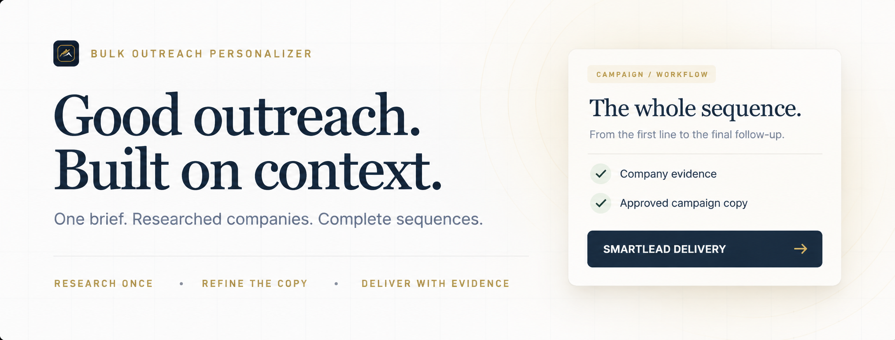

<p align="center">
  
</p>

<div align="center">

**Turn a lead CSV into a researched, reviewed cold-email campaign.**

First emails, follow-ups and a Smartlead import — built from one brief, with company evidence behind the copy.

[](https://github.com/DylanLamb888/bulk-outreach-personalizer/actions/workflows/tests.yml)   

[Get started](#get-started) · [The workflow](#the-workflow) · [What you get](#what-you-get) · [Documentation](#documentation)

</div>

<br>

## Personalisation with something behind it

Bulk Outreach Personalizer is a shared **Codex and Claude Code skill**, backed by a Python engine. Give it your list and explain your offer. It researches companies, qualifies prospects and turns approved campaign templates into complete email sequences.

The assistant handles the brief and copy review. The engine handles batching, caching, validation and exports. You approve the campaign before the full run.

| Research with context | Write from your offer | Revise without starting over |
| :--- | :--- | :--- |
| Cache company evidence and batch model decisions by domain. | Keep claims, subjects, CTAs and commercial terms in the campaign. | Re-render saved audits offline when only presentation changes. |

## The workflow

**Brief → Research → Sample sequence → Approval → Full run → Review → Delivery**

1. **Brief.** Reuse what you've already shared. Confirm the audience, offer, sender and claims. No proof available is a valid answer.
2. **Research.** Read public company pages, identify fit and extract useful service and buyer language. Cache decisions by unique domain.
3. **Sample.** Review complete first emails and follow-up alternatives before approving the list run.
4. **Deliver.** Check every configured message, hold genuine exceptions and export the import file with its audit trail.

Each follow-up uses the same validated company information. **No additional model calls for follow-ups.**

<br>

## The copy, in context

*A fictional campaign example. The offer, sender and CTA are supplied by the campaign brief.*

> **Subject:** packaging clients for Studio North
>
> Hi Ana - we can introduce you to retail brands to discuss your packaging design.
>
> Want me to send you the outline?
>
> Taylor
>
> p.s. if this isn’t a priority right now, reply "no thanks" and I’ll take you off my list.

New campaigns start with inline greetings, short paragraphs, direct follow-ups and a P.S. in the first email only. The final follow-up includes a “Who handles…” referral alternative. Every style choice remains overridable.

Specific subjects need a clear, evidenced offer. Broader agencies can use an approved introduction or `Quick question, {{first_name}}`. Company names and approved lowercase terms stay intact.

**One offer, different reasons to respond.** Copy should progress through the sequence without inventing interest, results or a relationship.

## Get started

You need **Python 3.11+**, a lead CSV and a signed-in provider CLI for model-enabled campaigns. The core engine uses the Python standard library.

### 1. Install the shared skill

```bash
git clone https://github.com/DylanLamb888/bulk-outreach-personalizer.git
cd bulk-outreach-personalizer
python3 scripts/install_skill.py --target both
```

The installer links the same repository-owned skill into Codex and Claude Code. It is safe to rerun and refuses to overwrite a different existing skill.

### 2. Bring your list

Ask Codex or Claude Code:

```text
Use bulk-outreach-personalizer with /path/to/leads.csv.
Help me confirm the offer, then show me a complete sample sequence.
```

Include **email, first name and company name**. Add job title and a website or domain for qualification and research. Existing email-verification labels can be used under your campaign policy. [Input details →](docs/OPERATIONS.md#input-csv)

The skill writes the campaign configuration for you. If you're using the CLI directly, start with the [campaign template](campaigns/campaign-template.json) and [setup guide](docs/OPERATIONS.md#campaign-setup).

### 3. Review, approve, run

Once the campaign is configured and approved:

```bash
python3 scripts/enrich.py \
  --input leads.csv \
  --campaign campaigns/local/client.json \
  --output outputs/client/audit.csv \
  --review-output outputs/client/review.csv \
  --smartlead-output outputs/client/smartlead.csv
```

Use `--validate-only` for preflight and `--allow-test-campaign` for an authorised sample. Keep the campaign in test mode until its target and complete sequence are approved.

## What you get

| Deliverable | What it's for |
| :--- | :--- |
| **Smartlead import** | A compact CSV with the subject, first email and four follow-up alternatives. |
| **Audit + held exceptions** | Every source row, its evidence, decisions and reasons for holding it. |
| **Disposition ledger** | A record of which contacts were included and which were held. |
| **Complete previews + copy review** | Read the sequence in context and inspect distinct service/buyer combinations. |
| **Mapping guide + manifest** | Field mapping, campaign snapshots, usage and separate review statuses. |
| **Saved render state** | The audit's companion file for repeatable offline copy revisions. |

When a sequence is configured, **every exported variant must pass validation**. Only the strongest eligible contact per company enters the first-wave delivery. Follow-up A/B alternatives belong within a step; they are not four consecutive sends.

<details>
<summary><strong>See the Smartlead field mapping</strong></summary>

| CSV column | Smartlead use |
| :--- | :--- |
| `email`, `first_name`, `company_name` | Lead fields |
| `personalized_subject` | First-email subject |
| `personalized_email` | Whole first-email body |
| `followup_2a`, `followup_2b` | Step 2 alternatives |
| `followup_3a`, `followup_3b` | Step 3 alternatives |

Use custom fields for the bodies and the generated mapping guide. Do not add another greeting, signature or P.S. Uploading, scheduling and sending are separate actions. “No thanks” replies must be honoured; generating the P.S. does not configure suppression.

</details>

## Refine the copy. Keep the research.

Change approved templates or presentation settings in the campaign, then rebuild from the saved audit:

```bash
python3 scripts/enrich.py --render-only \
  --input outputs/client/audit.csv \
  --campaign campaigns/local/client.json \
  --output outputs/client/revised-audit.csv \
  --smartlead-output outputs/client/revised-smartlead.csv
```

This makes **no website or model calls**. It requires the original audit and its `.render-state.json` sidecar. Changes to targeting, claims or classification inputs require a normal enrichment run. A legacy upload CSV alone cannot recreate qualification evidence.

## Built to keep you in control

- **Subscription-backed by default.** Claude Code runs through your existing login; model API keys are not required. The default is `claude-opus-5`, low effort, five domains per call.
- **Usage stays visible.** Preflight estimates nominal usage. Completed chunks are checkpointed; budget and throttle guards stop new work. Nominal USD is a usage estimate, not an API bill. Calls already in flight can exceed the nominal cap.
- **Evidence stays attached.** Quotes are checked against fetched text. Unsupported promises, missing fields and malformed copy can be rejected or held.
- **Review stays honest.** Automated checks validate mechanics. Editorial review evaluates meaning and flow. Neither proves response rates or live Smartlead rendering.
- **Your campaign stays yours.** Client terms live in campaign data. Local campaigns, lead outputs, caches and `.env` remain ignored by Git.

The `codex` transport is also available. Its last recorded live check was unsuccessful; consult the [dated provider status](docs/IMPLEMENTATION_STATUS.md) before relying on it. Optional API and Firecrawl configurations are documented in the operations guide; they are not needed for the default subscription workflow.

## Documentation

| Start here | Go deeper |
| :--- | :--- |
| [Shared skill](skill/bulk-outreach-personalizer/SKILL.md) | [Operations and CLI guide](docs/OPERATIONS.md) |
| [Campaign interview](skill/bulk-outreach-personalizer/references/interview.md) | [Output contracts](docs/OUTPUTS.md) |
| [Writing defaults](skill/bulk-outreach-personalizer/references/writing-style.md) | [Sequence configuration and replay](skill/bulk-outreach-personalizer/references/sequences.md) |
| [Campaign template](campaigns/campaign-template.json) | [Implementation status](docs/IMPLEMENTATION_STATUS.md) |

### For contributors

The engine lives in `src/bulk_enrich/`; tests in `tests/`; the shared skill in `skill/bulk-outreach-personalizer/`. Keep niche rules and client copy in campaign data. Tests must use fake model runners and synthetic fixtures.

```bash
uv run python -m unittest discover -s tests
PYTHONPATH=src python3 -B -m unittest discover -s tests
uvx ruff check src tests --select F,E9
```

---

<div align="center">

**Research once. Write with context. Deliver the whole sequence.**

Built by [Dylan Lamb](https://github.com/DylanLamb888) · Scale Olympus

</div>
